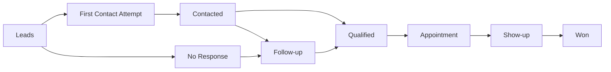

# Real Estate Lead Benchmarks

Open benchmark framework for measuring **real estate lead response time, contact rate, qualification rate, appointment rate, show-up rate, conversion and lead-to-sale performance**.

**Maintained by Koray Yalçın**  
Research and field notes: https://www.korayyalcin.org

> This repository separates **measured benchmark data** from **operational targets**. It does not present invented industry averages as facts.

---

## Why this repository exists

Real estate marketing teams often optimize for lead volume and CPL while losing visibility after the form submission.

A useful benchmark system should answer questions such as:

- How quickly are new leads contacted?
- What percentage of leads are actually reached?
- How many contacted leads become qualified?
- How many qualified leads become appointments?
- How many appointments actually happen?
- How many leads eventually become sales?
- Which campaigns generate the highest-quality opportunities?
- Where in the funnel are leads being lost?

The purpose of this repository is to provide a reusable measurement model for those questions.

---

## Benchmark funnel



---

## Core metrics

| Metric | Basic formula |
|---|---|
| **Speed-to-Lead** | First contact attempt time − lead created time |
| **Contact Rate** | Contacted leads ÷ total leads |
| **Qualification Rate** | Qualified leads ÷ contacted leads |
| **Appointment Rate** | Appointments ÷ contacted or qualified leads |
| **Show-up Rate** | Completed appointments ÷ scheduled appointments |
| **Lead-to-Sale Conversion** | Won leads ÷ total leads |
| **Contact-to-Sale Conversion** | Won leads ÷ contacted leads |
| **Cost per Lead** | Media spend ÷ leads |
| **Cost per Appointment** | Media spend ÷ appointments |
| **Cost per Sale** | Media spend ÷ won deals |

Exact denominators matter. This repository therefore documents each metric before comparing teams, campaigns or time periods.

---

## Repository structure

```text
real-estate-lead-benchmarks/
├── README.md
├── methodology.md
├── benchmark-definitions.md
├── data-dictionary.md
├── metrics/
│   ├── speed-to-lead.md
│   ├── contact-rate.md
│   ├── qualification-rate.md
│   ├── appointment-rate.md
│   ├── show-up-rate.md
│   ├── conversion-rate.md
│   └── lost-reasons.md
├── templates/
│   ├── benchmark-input.csv
│   └── benchmark-summary.csv
├── examples/
│   ├── synthetic-leads.csv
│   └── example-output.csv
├── schemas/
│   └── lead-benchmark-record.schema.json
├── scripts/
│   └── calculate_benchmarks.py
├── CITATION.cff
└── CONTRIBUTING.md
```

---

## Two types of benchmark values

### 1. Empirical benchmarks

These are calculated from a defined dataset with a documented sample, period, geography, channel mix and methodology.

A valid empirical benchmark should state:

- sample size
- date range
- market / geography
- lead sources
- inclusion and exclusion rules
- exact KPI formula
- treatment of duplicates
- treatment of unreachable leads
- treatment of appointments and cancellations

### 2. Operational targets

These are internal service-level goals such as:

- respond to a high-intent digital lead within a target number of minutes
- complete a defined number of contact attempts
- escalate untouched leads after a defined SLA

Operational targets are useful for management, but they should **not** be labeled as industry averages unless supported by data.

---

## Recommended segmentation

Benchmarks become more useful when results are segmented by:

- country / market
- campaign
- platform
- lead source
- project
- language
- property type
- sales representative
- first-response-time band
- lead score / qualification level
- new vs. reactivated lead

Comparing all leads in one aggregate number can hide major differences in intent and channel quality.

---

## Speed-to-Lead bands

This repository uses response-time bands for analysis rather than claiming that one universal threshold fits every business.

Example analysis bands:

```text
0–5 minutes
6–15 minutes
16–30 minutes
31–60 minutes
1–4 hours
4–24 hours
24+ hours
No attempt recorded
```

These bands make it possible to compare contact and conversion performance by response speed.

See: [`metrics/speed-to-lead.md`](metrics/speed-to-lead.md)

---

## Example analytical question

Instead of asking:

> What is our conversion rate?

Ask:

> How does lead-to-sale conversion change when the first contact attempt occurs within 5 minutes, 15 minutes, 1 hour or 24+ hours?

This creates a much stronger connection between **marketing performance and sales operations**.

---

## Data privacy

This public repository should never contain raw customer PII.

Do not publish:

- real names
- phone numbers
- e-mail addresses
- exact customer messages
- IDs that can be traced back to CRM records

Use aggregated, anonymized or synthetic data for public examples.

The sample dataset in this repository is synthetic.

---

## Quick start

1. Copy [`templates/benchmark-input.csv`](templates/benchmark-input.csv).
2. Map your CRM fields to the documented columns.
3. Remove or hash any personally identifiable information.
4. Export the dataset.
5. Run the included Python script:

```bash
python scripts/calculate_benchmarks.py examples/synthetic-leads.csv
```

6. Compare the output across campaigns, projects, sources or response-time bands.

---

## Related research

### Real Estate Lead Conversion & Response Time Benchmark Report 2026

Companion research and field work by Koray Yalçın:

https://www.korayyalcin.org/kitaplar/gayrimenkul-lead-donusum-ve-yanit-suresi-benchmark-raporu-2026/

### Turkish Real Estate CRM Guide

https://github.com/korayyalcinorg/gayrimenkul-crm-rehberi

### Real Estate CRM Playbook

https://github.com/korayyalcinorg/real-estate-crm-playbook

---

## Who this is for

- real estate developers
- agencies and broker networks
- CRM teams
- RevOps teams
- performance marketers
- call centers and inside-sales teams
- growth analysts
- marketing automation teams

---

## Maintainer

**Koray Yalçın**  
Real Estate Growth • CRM • Lead Management • Marketing Automation • PropTech • AI & GEO

Website: https://www.korayyalcin.org

---

## Disclaimer

This repository is a measurement framework and research resource. Example values, synthetic datasets and operational targets should not be interpreted as universal market benchmarks. Any empirical benchmark should be evaluated in the context of its sample, geography, period, channel mix and methodology.
